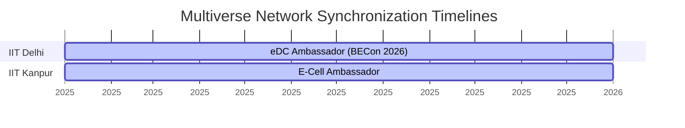
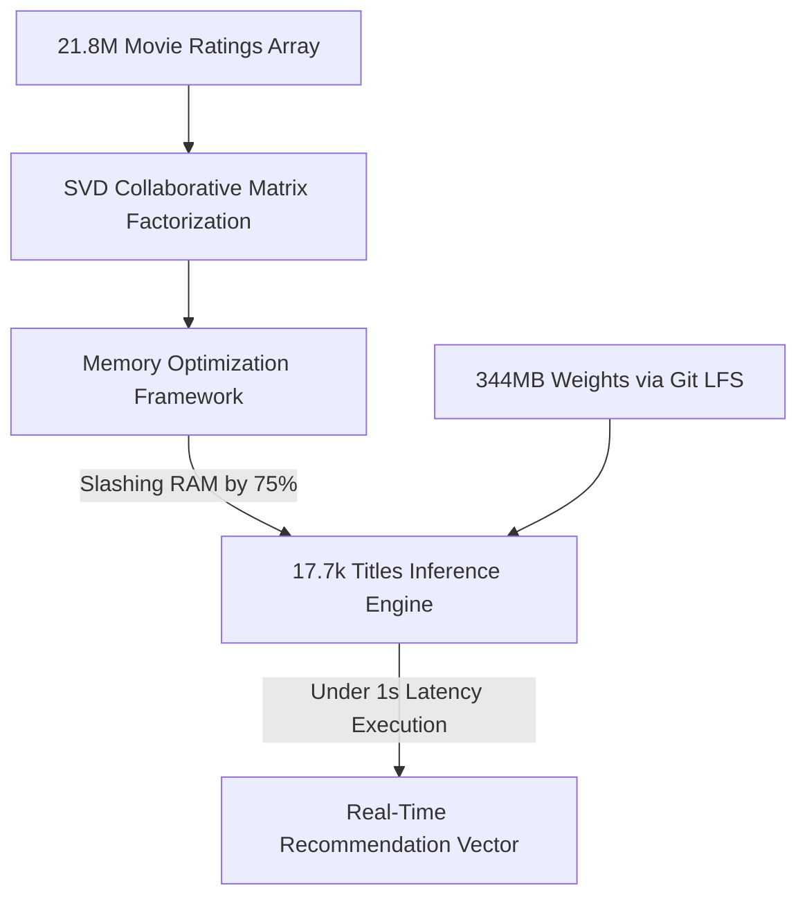
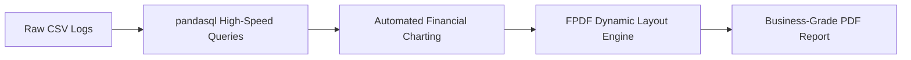
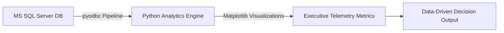

  <picture>
    <source media="(prefers-color-scheme: dark)" srcset="spidey_card.png">
    <source media="(prefers-color-scheme: light)" srcset="spidey_card.png">
    
  </picture>

<!-- 

  <strong>Aspiring Data Analyst &amp; AI Developer | Weaving Autonomous Systems &amp; Multiversal Data Pipelines</strong>

 -->

  
  
  

---

## 🕸️ The Web of Cognition (Vision)

> ### 🕷️ Multiverse Cognitive Protocols
> *"AI isn’t just code — it’s cognition. True innovation happens when data learns to decide."*
> 
> I am an engineer specialized in weaving autonomous decision-making systems and intelligent data pipelines. Operating at the intersection of deep analytical architectures and agentic AI, my focus is translating raw, chaotic multidimensional signals into optimized, cognitive automation workflows. My goal is to build state-of-the-art agentic workflows that adapt, learn, and deliver business-critical value across networks.

---

## 🧪 The Suit & Arsenal (Tech Stack)

### 🕸️ AI &amp; Machine Learning (Neural Webs)

  
  
  
  
   
  
  
  
  

### 📊 Data Analytics &amp; BI (Telemetry &amp; Mapping)

  
  
  
  
   
  
  
  

### 💻 Programming Languages (Voice Nodes)

  
  
  
  
   
  
  
  

### 🛠️ Tools &amp; Frameworks (Web Slingers)

  
  
  
   
  
  

---

## 📡 Anomalies Tracked Across the Spider-Verse (Impact & Outreach)

### 🏆 Multiverse Glitch Logs (Honors & Achievements)
*   🥇 **Top Ranker (Campus Ambassador Program, eDC IIT Delhi)**: Awarded a prestigious **Letter of Recommendation** for exceptional networking, coordination, and publicity driving significant social media growth and event footfall for the annual **Business Conclave (BECon 2026)**.
*   🚀 **Finalist (MumbaiHacks 2025)**: Scaled to the **Top 100 Finalist** echelon in one of Mumbai's most massive and competitive tech hackathons, pitching high-end, advanced AI solutions directly to industry leaders.

### 📅 Outreach Synchronizations

#### 🏛️ **eDC (Entrepreneurship Development Cell), IIT Delhi** | *Campus Ambassador*
*   Driven a **20% increase** in student registrations from target regional campuses.
*   Acted as primary operational liaison between eDC IIT Delhi and local student pipelines to streamline communication.
*   Executed creative digital marketing algorithms to boost engagement for the **Moonshot** initiative.
*   Ranked among the conclave's top-performing regional ambassadors.

#### 🏛️ **Entrepreneurship Cell, IIT Kanpur** | *Campus Ambassador*
*   Orchestrated regional workshops to cultivate entrepreneurship culture.
*   Recruited and onboarded high-potential student teams into national pitch-competition channels.
*   Administered promotional campaigns (digital & offline) to maximize reach for E-Summit events and speaker keynotes.

---

## 🌆 Glitching the Multiverse (Anomalies & Applications)

Deep-dive into my core structural engineering and analytical projects below:

<b>🎬 Netflix Recommendation Engine (SVD Matrix Factorization)</b>

### 🔧 Neural-Network Web Path

### 📊 System Telemetry
*   **Dimensional Volume:** Analyzed a heavy matrix of **21.8M ratings** to map latent preference structures.
*   **Collider Optimization:** Designed custom sparse array mappings, cutting system RAM footprint by **75%**.
*   **Latency Calibration:** Engineered a high-throughput pipeline resolving vectors over 17.7k titles in **<1s latency**.
*   **Payload Transport:** Optimized multi-dimensional weight storage by deploying the 344MB model payload via Git LFS.

**Tech Stack:** `Python`, `scikit-learn`, `Pandas`, `Git LFS`, `SVD Matrix Factorization`

<b>🤖 AI Business Report Generator (Automated Analytics & FPDF)</b>

### 🔧 Pipeline Web

### 📊 System Telemetry
*   **Process Automation:** Built an automated ETL web converting messy client CSV telemetry into structured business-grade PDF files.
*   **Query Synchronization:** Used `pandasql` to run optimized in-memory SQL syntax directly over active pandas data arrays.
*   **Dynamic Visuals:** Designed dynamic chart placement algorithms to inject executive trend graphs into standardized layouts.

**Tech Stack:** `Python`, `Pandas`, `pandasql`, `FPDF`, `Matplotlib`, `SQL`

<b>📊 Enterprise Sales Data Dashboard (SQL Server Pipeline)</b>

### 🔧 Architecture Integration

### 📊 System Telemetry
*   **Data Bridge:** Programmed a secure database socket connection using `pyodbc` to pipe MS SQL Server data directly into Python.
*   **Executive Aggregation:** Conducted T-SQL procedures to calculate core transactional KPIs, performance margins, and volume arrays.
*   **High-Impact Layout:** Rendered premium, dark-mode Matplotlib visuals tailored for executive decision boards.

**Tech Stack:** `Microsoft SQL Server`, `T-SQL`, `Python`, `pyodbc`, `Matplotlib`, `Pandas`

